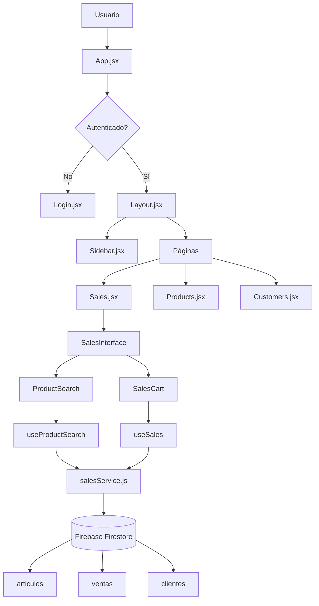
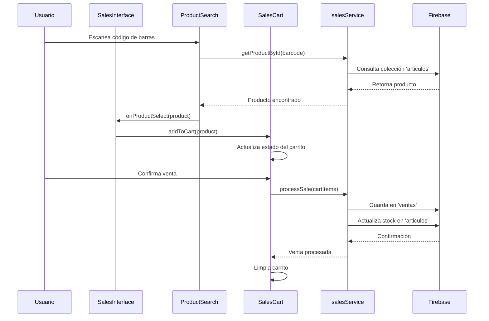
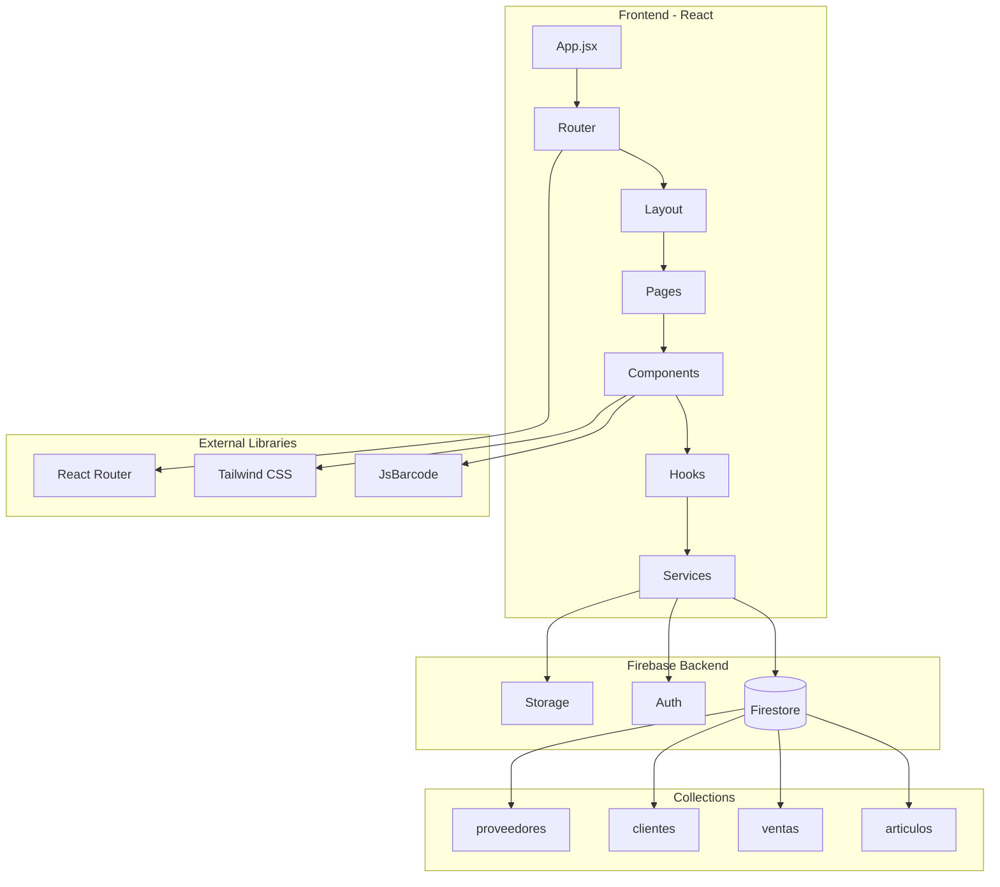

# 📋 Manual Completo - Sistema POS Rosema

## 🎯 Resumen Ejecutivo

**Rosema POS** es un sistema de punto de venta desarrollado con React + Vite + Firebase, diseñado para gestionar ventas, productos, clientes y proveedores de una tienda de ropa.

### Tecnologías Principales
- **Frontend**: React 18 + Vite
- **Backend**: Firebase (Firestore, Auth, Storage)
- **Estilos**: Tailwind CSS
- **Routing**: React Router DOM
- **Códigos de Barras**: JsBarcode

---

## 📁 1. MAPA GENERAL DEL PROYECTO

### Estructura de Carpetas

```
rosema-pos/
├── public/                     # Archivos estáticos
│   ├── index.html             # HTML base
│   ├── rosemalognegro.png     # Logo negro
│   └── rosemalogysubwhite.png # Logo blanco
├── scripts/                   # Scripts de importación
│   ├── importData.js          # Importar datos de prueba
│   └── importProviders.js     # Importar proveedores
├── src/
│   ├── components/            # Componentes React
│   │   ├── common/           # Componentes reutilizables
│   │   ├── Products/         # Componentes de productos
│   │   └── Sales/           # Componentes de ventas
│   ├── hooks/               # Custom hooks
│   ├── pages/               # Páginas principales
│   ├── services/            # Servicios Firebase
│   └── utils/               # Utilidades y helpers
├── firebase.json              # Configuración Firebase
├── firestore.rules           # Reglas de seguridad
└── package.json              # Dependencias
```

### Descripción de Carpetas

#### `/src/components/`
- **common/**: Componentes reutilizables (Modal, LoadingSpinner, SearchBar, etc.)
- **Products/**: Componentes específicos para gestión de productos
- **Sales/**: Componentes específicos para el proceso de ventas
- **Raíz**: Componentes principales y específicos

#### `/src/hooks/`
Custom hooks para lógica de negocio:
- `useAuth.js` - Autenticación Firebase
- `useProducts.js` - Gestión de productos
- `useSales.js` - Proceso de ventas
- `useCustomers.js` - Gestión de clientes

#### `/src/services/`
Servicios para comunicación con Firebase:
- `firebase.js` - Configuración Firebase
- `productsService.js` - CRUD productos
- `salesService.js` - Gestión de ventas
- `customersService.js` - Gestión de clientes

#### `/src/utils/`
Funciones utilitarias:
- `formatters.js` - Formateo de datos
- `calculations.js` - Cálculos de negocio
- `validators.js` - Validaciones
- `constants.js` - Constantes del sistema

---

## 📄 2. EXPLICACIÓN ARCHIVO POR ARCHIVO

### 🔧 Archivos de Configuración

#### `package.json`
```json
{
  "name": "rosema-pos",
  "dependencies": {
    "firebase": "^10.14.1",      // Backend y autenticación
    "react": "^18.2.0",         // Framework principal
    "react-router-dom": "^6.20.1", // Routing
    "jsbarcode": "^3.12.1"      // Generación códigos de barras
  }
}
```

#### `src/services/firebase.js`
**Rol**: Configuración central de Firebase
**Funciones**:
- Inicialización de Firebase App
- Exporta `auth`, `db`, `storage`
- Manejo de errores de conexión

```javascript
export const auth = getAuth(app);      // Autenticación
export const db = getFirestore(app);   // Base de datos
export const storage = getStorage(app); // Almacenamiento
```

### 🎯 Componente Principal

#### `src/App.jsx`
**Rol**: Componente raíz y router principal
**Funciones**:
- Manejo de rutas protegidas
- Verificación de autenticación
- Modo desarrollo (acceso directo)

**Rutas Principales**:
- `/login` - Página de login
- `/` - Dashboard principal
- `/sales` - Interfaz de ventas
- `/products` - Gestión de productos
- `/customers` - Gestión de clientes

### 🏗️ Layout y Navegación

#### `src/components/Layout.jsx`
**Rol**: Layout principal con sidebar
**Componentes**: Sidebar + Outlet (contenido dinámico)

#### `src/components/Sidebar.jsx`
**Rol**: Navegación lateral
**Funciones**:
- Enlaces a páginas principales
- Indicador de página activa
- Botón de logout

### 📊 Páginas Principales

#### `src/pages/Sales.jsx`
**Rol**: Interfaz principal de ventas
**Componentes que usa**:
- `SalesInterface` - Interfaz completa de ventas
- `ProductSearch` - Búsqueda de productos
- `SalesCart` - Carrito de compras

**Firebase**: Lee productos de colección `articulos`

#### `src/pages/Products.jsx`
**Rol**: Gestión de inventario
**Componentes que usa**:
- `ProductsTable` - Tabla de productos
- `ProductsFilters` - Filtros y búsqueda
- `ProductForm` - Formulario de productos

**Firebase**: CRUD completo en colección `articulos`

#### `src/pages/Customers.jsx`
**Rol**: Gestión de clientes
**Componentes que usa**:
- `CustomerForm` - Formulario de clientes
- `CustomerDetails` - Detalles del cliente

**Firebase**: CRUD en colección `clientes`

### 🔗 Servicios Firebase

#### `src/services/salesService.js`
**Rol**: Gestión completa de ventas
**Funciones principales**:
- `searchProductsForSale()` - Buscar productos para venta
- `getProductById()` - Obtener producto por código
- `validateVariantStock()` - Validar stock de variantes
- `processSale()` - Procesar venta completa
- `updateProductStock()` - Actualizar stock después de venta

**Interacciones Firebase**:
- Lee de `articulos` (productos)
- Escribe en `ventas` (ventas)
- Actualiza stock en tiempo real

#### `src/services/productsService.js`
**Rol**: CRUD de productos
**Funciones principales**:
- `getProducts()` - Obtener todos los productos
- `createProduct()` - Crear nuevo producto
- `updateProduct()` - Actualizar producto
- `deleteProduct()` - Eliminar producto

#### `src/services/customersService.js`
**Rol**: Gestión de clientes
**Funciones principales**:
- `getCustomers()` - Obtener clientes
- `createCustomer()` - Crear cliente
- `updateCustomerStats()` - Actualizar estadísticas

### 🎣 Custom Hooks

#### `src/hooks/useAuth.js`
**Rol**: Manejo de autenticación
**Estados**: `user`, `loading`, `error`, `isAuthenticated`
**Funciones**: `login()`, `logout()`
**Firebase**: Usa `onAuthStateChanged`, `signInWithEmailAndPassword`

#### `src/hooks/useSales.js`
**Rol**: Lógica de proceso de ventas
**Estados**: `cart`, `loading`, `error`
**Funciones**: 
- `addToCart()` - Agregar producto al carrito
- `removeFromCart()` - Remover del carrito
- `processSale()` - Procesar venta completa

#### `src/hooks/useProducts.js`
**Rol**: Gestión de productos
**Estados**: `products`, `loading`, `error`
**Funciones**: CRUD completo de productos
**Firebase**: Suscripción en tiempo real a productos

### 🛠️ Componentes Comunes

#### `src/components/common/Modal.jsx`
**Rol**: Modal base reutilizable
**Props**: `isOpen`, `onClose`, `title`, `children`
**Funciones**: Manejo de ESC, overlay click

#### `src/components/common/LoadingSpinner.jsx`
**Rol**: Indicador de carga
**Props**: `size`, `color`

#### `src/components/common/SearchBar.jsx`
**Rol**: Barra de búsqueda reutilizable
**Props**: `value`, `onChange`, `placeholder`

### 🛒 Componentes de Ventas

#### `src/components/SalesInterface.jsx`
**Rol**: Interfaz completa de ventas
**Componentes que incluye**:
- Búsqueda de productos
- Carrito de compras
- Formulario de pago
- Historial de ventas

#### `src/components/SalesCart.jsx`
**Rol**: Carrito de compras
**Funciones**:
- Mostrar items del carrito
- Calcular totales
- Aplicar descuentos
- Procesar pago

### 📦 Componentes de Productos

#### `src/components/ProductForm.jsx`
**Rol**: Formulario para crear/editar productos
**Campos**:
- Información básica (nombre, precio, categoría)
- Variantes (talle, color, stock)
- Imágenes
- Proveedor

#### `src/components/ProductSearch.jsx`
**Rol**: Búsqueda de productos para ventas
**Funciones**:
- Búsqueda por código de barras
- Búsqueda por nombre
- Selección de variantes

### 🧮 Utilidades

#### `src/utils/formatters.js`
**Funciones**:
- `formatPrice()` - Formatear precios
- `formatDate()` - Formatear fechas
- `formatStock()` - Formatear stock

#### `src/utils/calculations.js`
**Funciones**:
- `calculateSaleTotal()` - Calcular total de venta
- `calculateDiscount()` - Calcular descuentos
- `roundToNearest500()` - Redondear precios

#### `src/utils/constants.js`
**Constantes**:
- `PRODUCT_CATEGORIES` - Categorías de productos
- `PAYMENT_METHODS` - Métodos de pago
- `STOCK_STATUS` - Estados de stock

---

## 🔄 3. FLUJO DE DATOS

### Diagrama Principal del Sistema



### Flujo de Venta



### Flujo de Autenticación

```mermaid
graph LR
    A[Usuario ingresa credenciales] --> B[useAuth.login()]
    B --> C[Firebase Auth]
    C --> D{Válido?}
    D -->|Sí| E[onAuthStateChanged]
    D -->|No| F[Error de login]
    E --> G[Actualiza estado user]
    G --> H[Redirige a dashboard]
    F --> I[Muestra error]
```

---

## 🗑️ 4. ARCHIVOS RESIDUALES Y DUPLICADOS

### Archivos Duplicados Detectados

#### 1. SalesCart Duplicado
- **Ubicación 1**: `src/components/SalesCart.jsx`
- **Ubicación 2**: `src/components/Sales/SalesCart.jsx`
- **Problema**: Dos implementaciones del mismo componente
- **Recomendación**: Mantener solo `src/components/Sales/SalesCart.jsx` y eliminar el de la raíz

#### 2. ProductSearch Duplicado
- **Ubicación 1**: `src/components/ProductSearch.jsx`
- **Ubicación 2**: `src/components/Sales/ProductSearch.jsx`
- **Problema**: Funcionalidades similares pero diferentes
- **Recomendación**: Unificar en un solo componente más flexible

### Código de Debug Residual

#### Console.log Excesivos
**Archivos afectados**:
- `src/services/salesService.js` (15+ console.log)
- `src/services/providersService.js` (8+ console.log)
- `src/hooks/useProductSearch.js` (5+ console.log)

**Recomendación**: Crear un sistema de logging condicional:
```javascript
const DEBUG = process.env.NODE_ENV === 'development';
const log = DEBUG ? console.log : () => {};
```

### Componentes Potencialmente No Utilizados

#### 1. FirestoreDebug.jsx
- **Ubicación**: `src/components/FirestoreDebug.jsx`
- **Propósito**: Testing de conexión Firebase
- **Estado**: Solo para desarrollo
- **Recomendación**: Mover a carpeta `/dev` o eliminar en producción

#### 2. BarcodeModal.jsx vs BarcodePrinter.jsx
- **Problema**: Funcionalidades similares de códigos de barras
- **Recomendación**: Unificar en un solo componente

### Importaciones No Utilizadas

#### En utils/index.js
```javascript
// Algunas exportaciones pueden no estar siendo utilizadas
export * from './productHelpers.js';
export * from './salesHelpers.js';
```

**Recomendación**: Auditar importaciones reales y limpiar exports no utilizados.

---

## 🚀 5. SUGERENCIAS DE MEJORA

### 5.1 Organización de Carpetas

#### Estructura Propuesta
```
src/
├── components/
│   ├── ui/              # Componentes UI básicos (Button, Input, etc.)
│   ├── forms/           # Formularios específicos
│   ├── modals/          # Todos los modales
│   ├── tables/          # Componentes de tablas
│   └── features/        # Componentes por funcionalidad
│       ├── sales/
│       ├── products/
│       ├── customers/
│       └── auth/
├── hooks/
├── services/
├── utils/
├── contexts/            # React Contexts
├── constants/           # Constantes separadas por dominio
└── types/              # TypeScript types (futuro)
```

### 5.2 Separación de Responsabilidades

#### Crear Contexts para Estado Global
```javascript
// src/contexts/SalesContext.jsx
export const SalesContext = createContext();
export const useSalesContext = () => useContext(SalesContext);
```

#### Implementar Patrón Repository
```javascript
// src/repositories/ProductRepository.js
export class ProductRepository {
  async findById(id) { /* ... */ }
  async findByBarcode(barcode) { /* ... */ }
  async create(product) { /* ... */ }
}
```

### 5.3 Mejoras de Performance

#### 1. Lazy Loading de Páginas
```javascript
const Sales = lazy(() => import('./pages/Sales'));
const Products = lazy(() => import('./pages/Products'));
```

#### 2. Memoización de Componentes
```javascript
const ProductCard = memo(({ product, onSelect }) => {
  // Componente memoizado
});
```

#### 3. Virtualización de Listas Largas
```javascript
// Para tablas con muchos productos
import { FixedSizeList as List } from 'react-window';
```

### 5.4 Manejo de Errores

#### Error Boundary Global
```javascript
// src/components/ErrorBoundary.jsx
class ErrorBoundary extends Component {
  constructor(props) {
    super(props);
    this.state = { hasError: false };
  }
  
  static getDerivedStateFromError(error) {
    return { hasError: true };
  }
  
  render() {
    if (this.state.hasError) {
      return <ErrorFallback />;
    }
    return this.props.children;
  }
}
```

### 5.5 Testing

#### Estructura de Tests Propuesta
```
src/
├── __tests__/
│   ├── components/
│   ├── hooks/
│   ├── services/
│   └── utils/
├── __mocks__/
│   └── firebase.js
└── setupTests.js
```

#### Ejemplo de Test
```javascript
// src/__tests__/components/SalesCart.test.jsx
import { render, screen } from '@testing-library/react';
import SalesCart from '../components/Sales/SalesCart';

test('renders empty cart message', () => {
  render(<SalesCart cart={[]} />);
  expect(screen.getByText('Carrito vacío')).toBeInTheDocument();
});
```

### 5.6 Modo Offline

#### Service Worker para Cache
```javascript
// public/sw.js
self.addEventListener('fetch', (event) => {
  if (event.request.url.includes('/api/')) {
    event.respondWith(
      caches.match(event.request)
        .then(response => response || fetch(event.request))
    );
  }
});
```

#### Estado Offline en React
```javascript
// src/hooks/useOffline.js
export const useOffline = () => {
  const [isOffline, setIsOffline] = useState(!navigator.onLine);
  
  useEffect(() => {
    const handleOnline = () => setIsOffline(false);
    const handleOffline = () => setIsOffline(true);
    
    window.addEventListener('online', handleOnline);
    window.addEventListener('offline', handleOffline);
    
    return () => {
      window.removeEventListener('online', handleOnline);
      window.removeEventListener('offline', handleOffline);
    };
  }, []);
  
  return isOffline;
};
```

---

## 📊 6. DIAGRAMA DE ARQUITECTURA COMPLETO



---

## 🎯 7. GUÍA DE MANTENIMIENTO

### Tareas Regulares

#### Semanales
- [ ] Revisar logs de errores en Firebase Console
- [ ] Verificar performance de consultas Firestore
- [ ] Limpiar console.log de desarrollo

#### Mensuales
- [ ] Actualizar dependencias npm
- [ ] Revisar reglas de seguridad Firestore
- [ ] Optimizar índices de base de datos
- [ ] Backup de datos críticos

#### Trimestrales
- [ ] Auditoría de código no utilizado
- [ ] Revisión de performance general
- [ ] Actualización de documentación
- [ ] Testing de funcionalidades críticas

### Monitoreo

#### Métricas Clave
- Tiempo de carga de páginas
- Errores de autenticación
- Fallos en procesamiento de ventas
- Uso de almacenamiento Firebase

#### Alertas Recomendadas
- Errores 500+ por minuto
- Tiempo de respuesta > 3 segundos
- Fallos de autenticación > 10%
- Uso de Firestore > 80% del límite

---

## 📚 8. RECURSOS Y DOCUMENTACIÓN

### Enlaces Útiles
- [React Documentation](https://reactjs.org/docs)
- [Firebase Documentation](https://firebase.google.com/docs)
- [Tailwind CSS](https://tailwindcss.com/docs)
- [Vite Documentation](https://vitejs.dev/guide/)

### Comandos Útiles

#### Desarrollo
```bash
npm run dev          # Servidor de desarrollo
npm run build        # Build de producción
npm run preview      # Preview del build
```

#### Firebase
```bash
firebase deploy      # Deploy a Firebase Hosting
firebase emulators:start  # Emuladores locales
```

#### Mantenimiento
```bash
npm audit           # Auditoría de seguridad
npm outdated        # Dependencias desactualizadas
npm run lint        # Linting del código
```

---

## ✅ 9. CHECKLIST DE IMPLEMENTACIÓN

### Mejoras Inmediatas (Prioridad Alta)
- [ ] Eliminar archivos duplicados (SalesCart, ProductSearch)
- [ ] Limpiar console.log de producción
- [ ] Implementar manejo de errores global
- [ ] Optimizar consultas Firebase

### Mejoras a Mediano Plazo (Prioridad Media)
- [ ] Reorganizar estructura de carpetas
- [ ] Implementar lazy loading
- [ ] Agregar tests unitarios
- [ ] Mejorar accesibilidad

### Mejoras a Largo Plazo (Prioridad Baja)
- [ ] Migrar a TypeScript
- [ ] Implementar PWA
- [ ] Agregar modo offline
- [ ] Internacionalización (i18n)

---

## 🔧 10. TROUBLESHOOTING COMÚN

### Problemas Frecuentes

#### 1. Error de Conexión Firebase
**Síntoma**: "Error al inicializar Firebase"
**Solución**: Verificar credenciales en `firebase.js`

#### 2. Productos No Aparecen
**Síntoma**: Lista de productos vacía
**Solución**: Verificar colección 'articulos' en Firestore

#### 3. Venta No Se Procesa
**Síntoma**: Error al procesar venta
**Solución**: Verificar stock y reglas de Firestore

#### 4. Autenticación Falla
**Síntoma**: No puede hacer login
**Solución**: Verificar configuración Auth en Firebase Console

### Logs de Debug

#### Habilitar Logs Detallados
```javascript
// En firebase.js
if (process.env.NODE_ENV === 'development') {
  console.log('Debug mode enabled');
  // Habilitar logs de Firebase
}
```

---

**Este manual debe ser actualizado regularmente conforme evolucione el proyecto. Última actualización: [Fecha actual]**

---

## 📞 Soporte

Para dudas o problemas con este manual:
1. Revisar la documentación oficial de las tecnologías
2. Consultar los logs de la aplicación
3. Verificar la configuración de Firebase
4. Contactar al equipo de desarrollo

**¡Mantén este manual actualizado para futuras referencias!** 🚀
