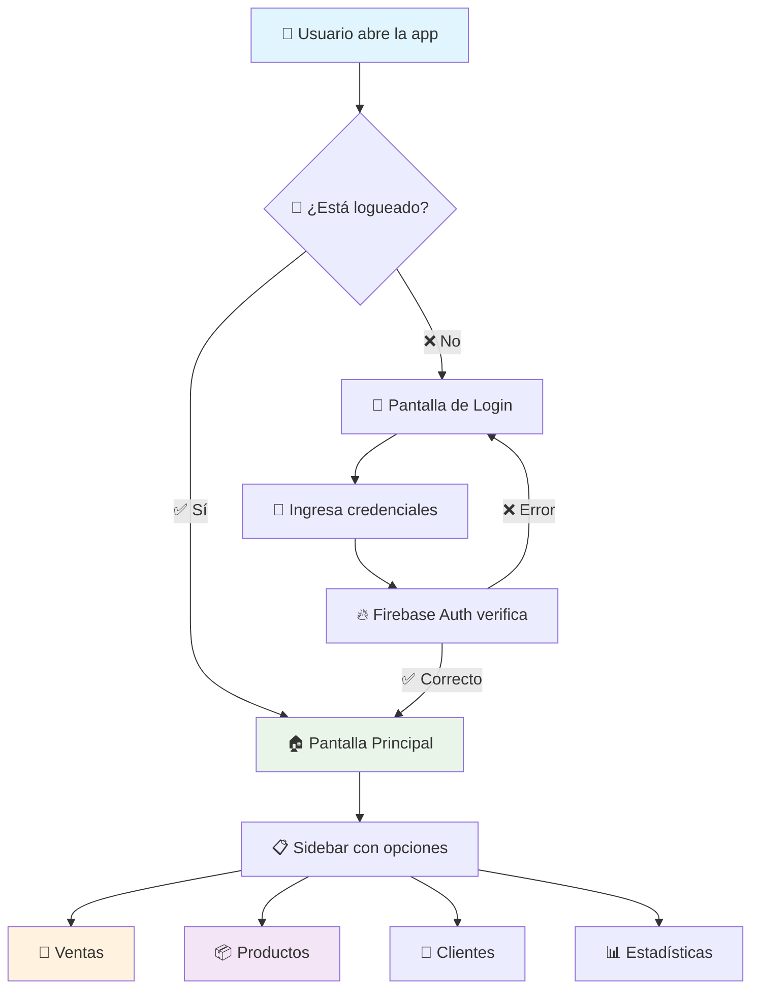
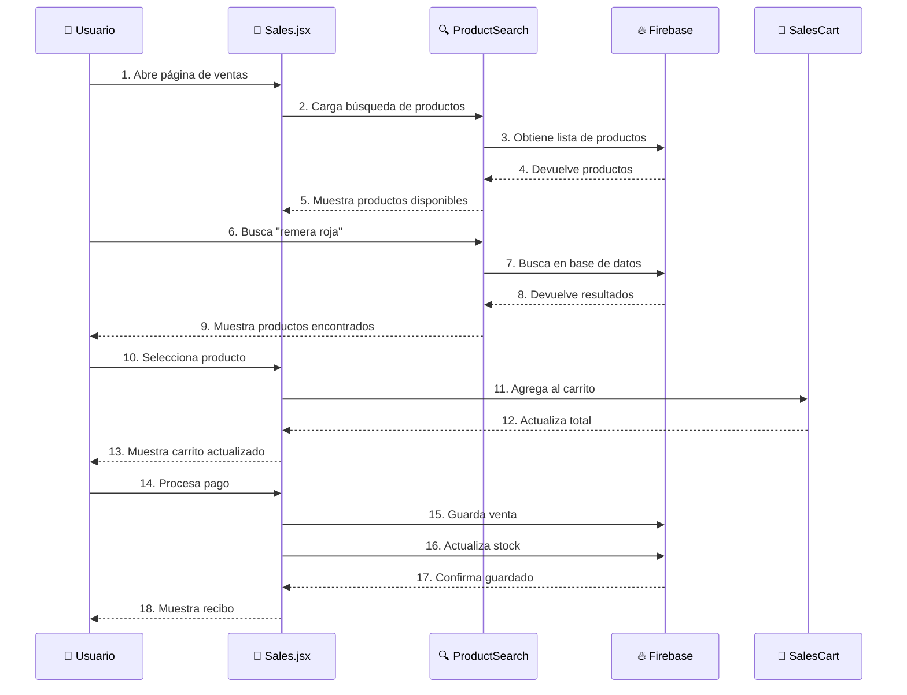
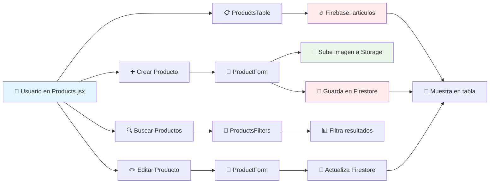
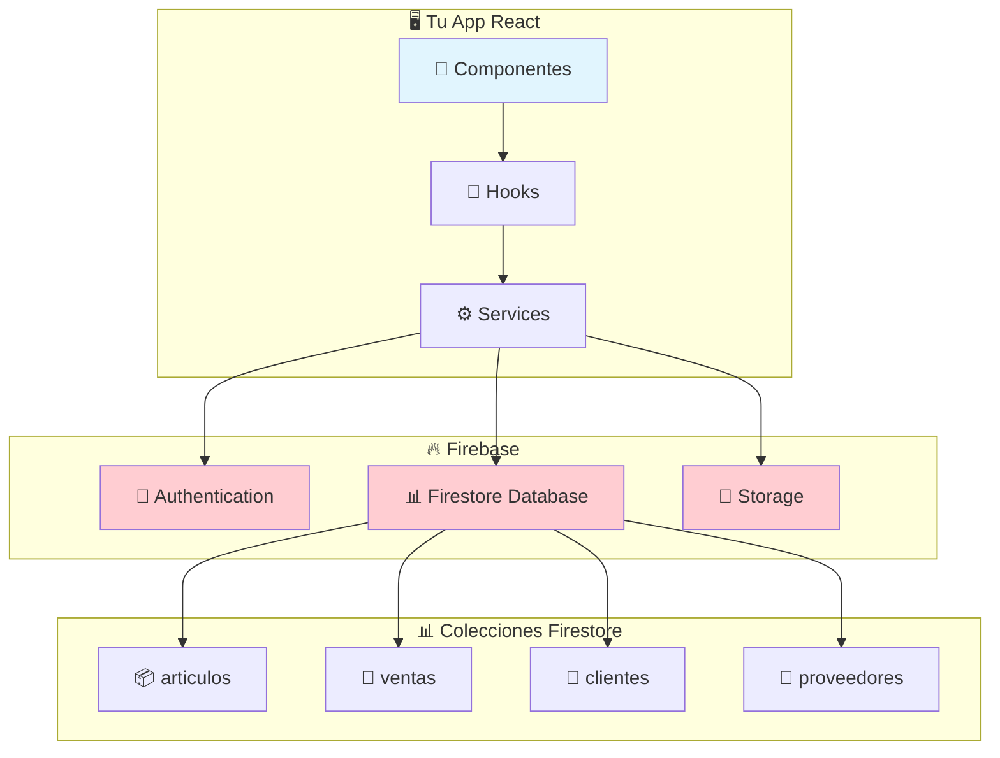
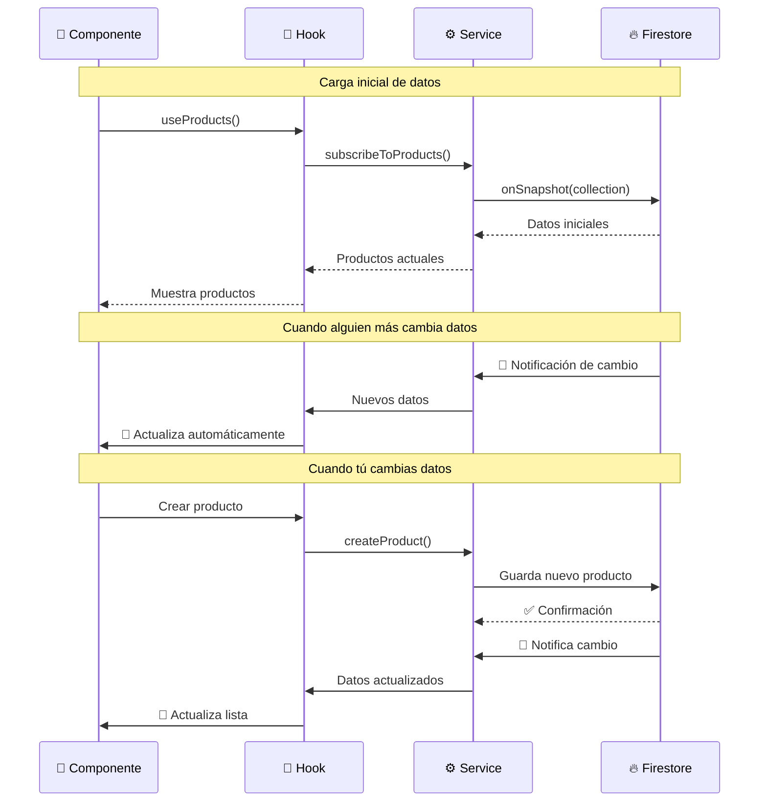
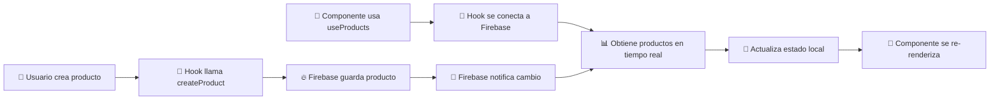
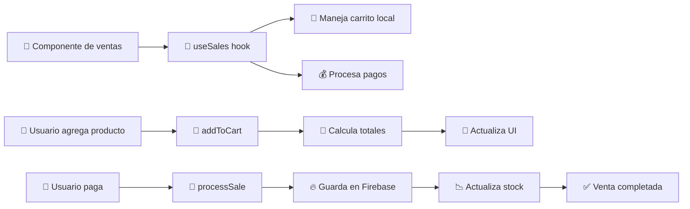

# 🌊 Manual de Flujo de Datos - Rosema POS

## 🎯 ¿Qué es el Flujo de Datos?

El **flujo de datos** es como el agua que corre por las tuberías de tu casa. En tu app, los datos (productos, ventas, clientes) "fluyen" desde Firebase hasta la pantalla del usuario, y viceversa.

---

## 🚀 Flujo Principal de la Aplicación



**Para principiantes:** Este diagrama muestra el primer flujo cuando abres la app.

---

## 🛒 Flujo del Sistema de Ventas



**Para principiantes:** Este diagrama muestra paso a paso cómo funciona una venta.

---

## 📦 Flujo de Gestión de Productos



**Para principiantes:** Aquí ves cómo se crean, editan y muestran los productos.

---

## 🔥 Interacciones con Firebase



**Para principiantes:** Tu app habla con Firebase a través de los "services".

---

## 🛒 Flujo Detallado de una Venta

```mermaid
flowchart TD
    A[🛒 Usuario inicia venta] --> B[🔍 Busca producto]
    B --> C{📦 ¿Producto encontrado?}
    
    C -->|❌ No| D[⚠️ Muestra "No encontrado"]
    C -->|✅ Sí| E[📋 Muestra opciones de variantes]
    
    E --> F[👤 Usuario selecciona talla/color]
    F --> G{📊 ¿Hay stock?}
    
    G -->|❌ No| H[⚠️ Muestra "Sin stock"]
    G -->|✅ Sí| I[➕ Agrega al carrito]
    
    I --> J[🧮 Calcula totales]
    J --> K{🛒 ¿Más productos?}
    
    K -->|✅ Sí| B
    K -->|❌ No| L[💳 Selecciona método de pago]
    
    L --> M[💰 Procesa pago]
    M --> N[📝 Crea registro de venta]
    N --> O[📉 Actualiza stock]
    O --> P[📄 Genera recibo]
    P --> Q[✅ Venta completada]
    
    style A fill:#e1f5fe
    style Q fill:#e8f5e8
    style D fill:#ffcdd2
    style H fill:#ffcdd2
```

**Para principiantes:** Este es el flujo completo de una venta, desde buscar hasta completar.

---

## 📊 Flujo de Datos en Tiempo Real



**Para principiantes:** Tu app se actualiza automáticamente cuando alguien más hace cambios.

---

## 🗂️ Estructura de Datos en Firebase

### 📦 Colección: `articulos` (Productos)
```javascript
{
  id: "REM001",                    // Código de barras
  articulo: "Remera Básica",       // Nombre del producto
  categoria: "mujer",              // Categoría
  precioCosto: 1500,               // Precio de compra
  variantes: [                     // Diferentes tallas/colores
    {
      talle: "M",
      color: "Rojo",
      stock: 10,
      precioVenta: 3000
    },
    {
      talle: "L", 
      color: "Azul",
      stock: 5,
      precioVenta: 3000
    }
  ],
  proveedorId: "PROV001",          // ID del proveedor
  createdAt: "2024-01-15",         // Fecha de creación
  updatedAt: "2024-01-20"          // Última actualización
}
```

### 🛒 Colección: `ventas` (Ventas)
```javascript
{
  saleNumber: "20241215-001",      // Número único de venta
  items: [                         // Productos vendidos
    {
      productId: "REM001",
      productName: "Remera Básica",
      talle: "M",
      color: "Rojo", 
      price: 3000,
      quantity: 2,
      subtotal: 6000
    }
  ],
  paymentMethod: "Efectivo",       // Método de pago
  total: 6000,                     // Total de la venta
  customerName: "Juan Pérez",      // Cliente
  saleDate: "2024-12-15",         // Fecha de venta
  status: "completed"              // Estado
}
```

### 👥 Colección: `clientes` (Clientes)
```javascript
{
  nombre: "Juan Pérez",            // Nombre del cliente
  telefono: "2604123456",          // Teléfono
  email: "juan@email.com",         // Email
  totalCompras: 15000,             // Total gastado
  cantidadCompras: 5,              // Número de compras
  ultimaCompra: "2024-12-15",      // Última compra
  fechaRegistro: "2024-01-10"      // Fecha de registro
}
```

---

## 🔄 Hooks y su Flujo de Datos

### `useProducts` - Gestión de Productos


### `useSales` - Gestión de Ventas


---

## 🎯 Para Principiantes: Puntos Clave

### 1. **El flujo siempre es:**
```
Usuario → Componente → Hook → Service → Firebase → Service → Hook → Componente → Usuario
```

### 2. **Los datos van en dos direcciones:**
- **Hacia Firebase:** Cuando guardas algo nuevo
- **Desde Firebase:** Cuando cargas o actualizas datos

### 3. **Los hooks son el "cerebro":**
- Manejan el estado (qué datos tienes)
- Llaman a los services (para hablar con Firebase)
- Proveen funciones a los componentes

### 4. **Los services son los "mensajeros":**
- Hablan directamente con Firebase
- Convierten los datos al formato que necesitas
- Manejan errores de conexión

### 5. **Firebase es tu "almacén":**
- Guarda todos tus datos
- Los mantiene sincronizados en tiempo real
- Los protege con reglas de seguridad

---

## 🚨 Errores Comunes en el Flujo

### ❌ **Error 1: No esperar datos de Firebase**
```javascript
// MAL ❌
const products = useProducts();
console.log(products[0].name); // Error si products está vacío

// BIEN ✅
const products = useProducts();
if (products.length > 0) {
  console.log(products[0].name);
}
```

### ❌ **Error 2: No manejar estados de carga**
```javascript
// MAL ❌
function ProductList() {
  const products = useProducts();
  return products.map(p => <div>{p.name}</div>);
}

// BIEN ✅
function ProductList() {
  const { products, loading } = useProducts();
  
  if (loading) return <div>Cargando...</div>;
  
  return products.map(p => <div>{p.name}</div>);
}
```

### ❌ **Error 3: Modificar datos directamente**
```javascript
// MAL ❌
products[0].stock = 10; // No actualiza Firebase

// BIEN ✅
updateProduct(products[0].id, { stock: 10 }); // Usa el service
```

---

## 💡 Consejos para Entender el Flujo

1. **Sigue el camino de los datos:** Desde donde se crean hasta donde se muestran
2. **Usa las herramientas de desarrollo:** Para ver qué datos tienes en cada momento
3. **Lee los console.log:** Te muestran qué está pasando paso a paso
4. **Empieza por un flujo simple:** Como mostrar una lista de productos
5. **Luego ve a flujos complejos:** Como procesar una venta completa

---

## 📚 Próximos Pasos

1. **Practica siguiendo un flujo:** Abre la app y ve paso a paso qué pasa cuando haces una venta
2. **Lee el código de los hooks:** Especialmente `useProducts` y `useSales`
3. **Experimenta:** Agrega un `console.log` en diferentes partes para ver los datos
4. **Lee el Manual de Archivos Residuales:** Para entender qué código no se usa

¡Recuerda: entender el flujo de datos es clave para programar bien! 🌊
