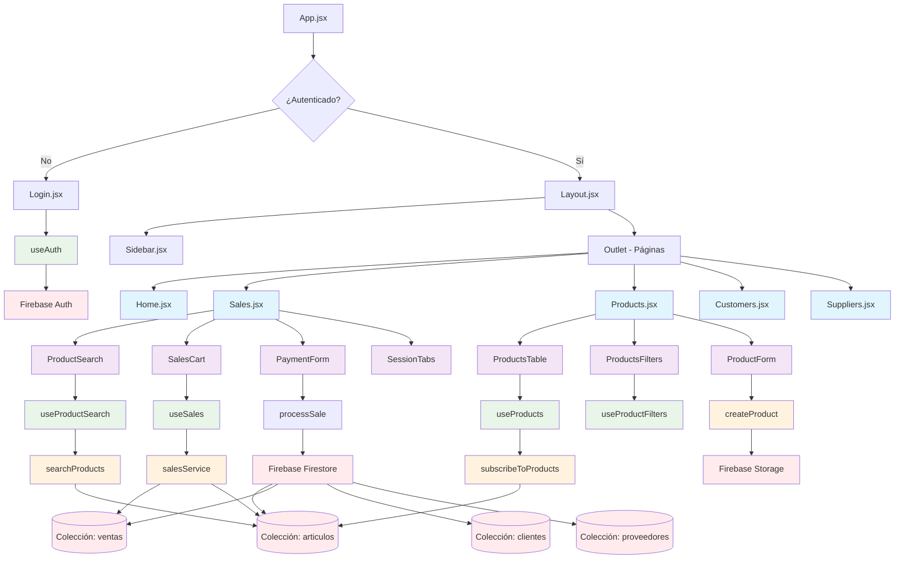
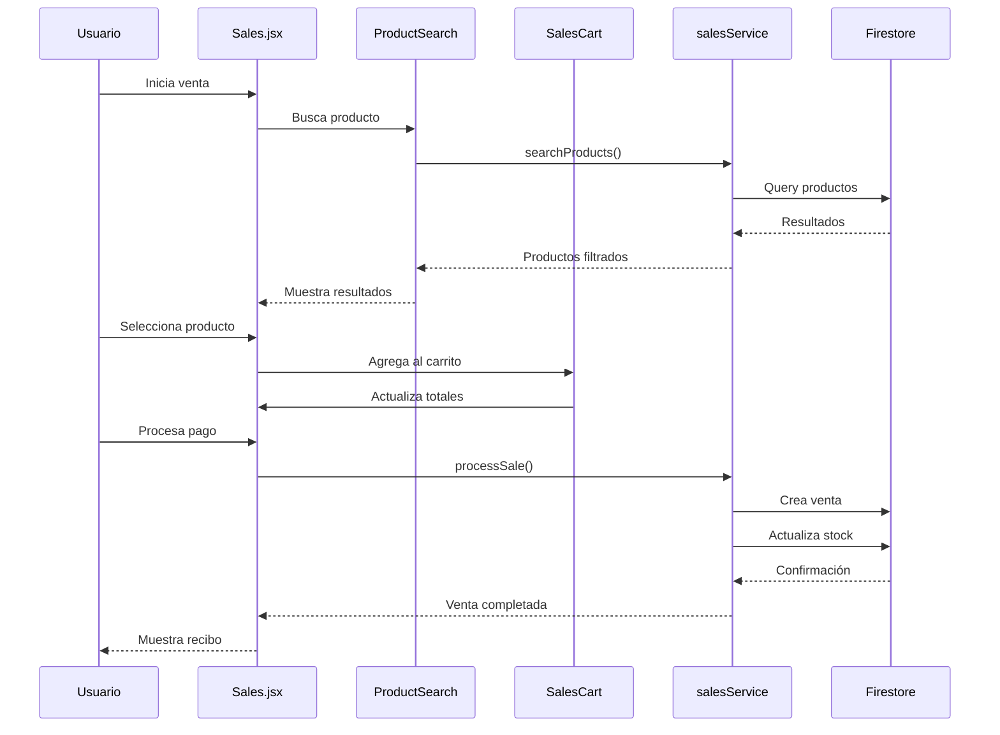
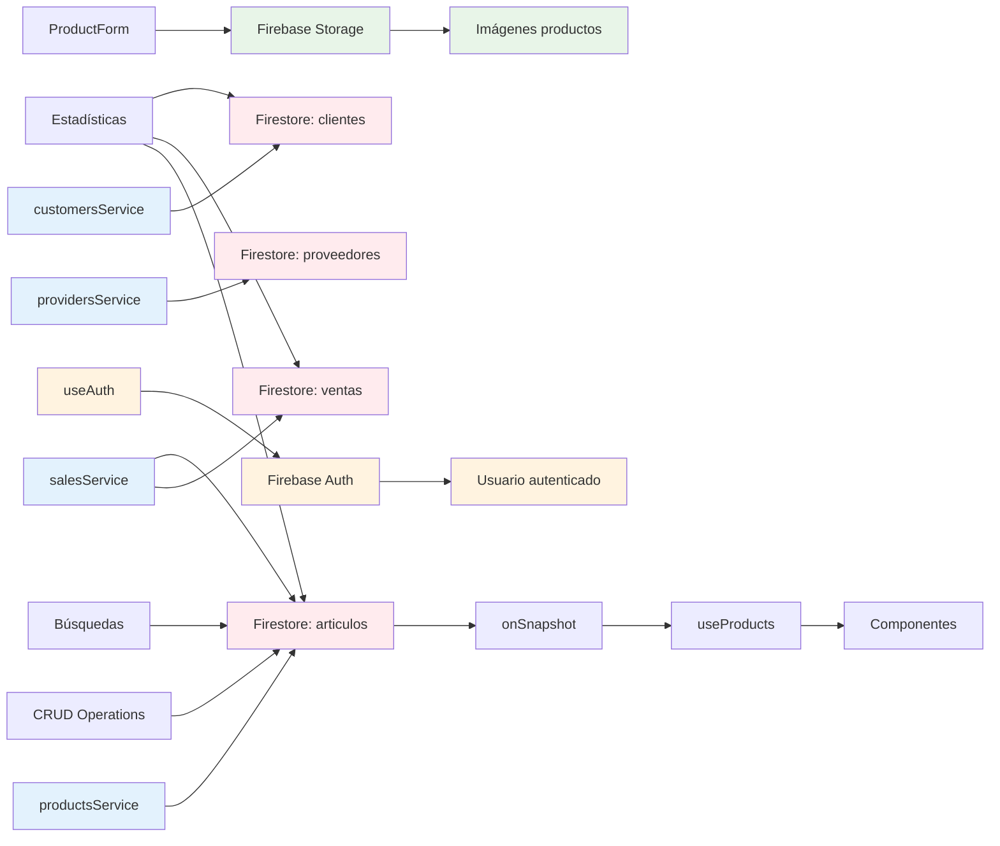

# 📋 Manual Completo del Proyecto Rosema POS

## 🏗️ 1. MAPA GENERAL DEL PROYECTO

### Estructura de Carpetas

```
rosema-pos/
├── 📁 public/                    # Archivos estáticos
│   ├── index.html               # HTML base
│   ├── rosemalognegro.png       # Logo negro
│   └── rosemalogysubwhite.png   # Logo blanco
├── 📁 scripts/                  # Scripts de utilidad
│   ├── importData.js            # Importación de datos
│   └── importProviders.js       # Importación de proveedores
├── 📁 src/                      # Código fuente principal
│   ├── 📁 components/           # Componentes React
│   │   ├── 📁 common/           # Componentes reutilizables
│   │   ├── 📁 Products/         # Componentes específicos de productos
│   │   └── 📁 Sales/            # Componentes específicos de ventas
│   ├── 📁 hooks/                # Custom hooks
│   ├── 📁 pages/                # Páginas principales
│   ├── 📁 services/             # Servicios Firebase
│   └── 📁 utils/                # Utilidades y helpers
├── 📄 Archivos de configuración
│   ├── package.json             # Dependencias y scripts
│   ├── vite.config.js           # Configuración Vite
│   ├── tailwind.config.js       # Configuración Tailwind
│   ├── firebase.json            # Configuración Firebase
│   └── firestore.rules          # Reglas de seguridad Firestore
└── 📄 Documentación
    ├── README.md                # Documentación principal
    ├── SISTEMA_VENTAS.md        # Documentación del sistema de ventas
    └── REFACTORING_SUMMARY.md   # Resumen de refactoring
```

---

## 🔥 2. INTERACCIONES CON FIREBASE

### 2.1 Configuración Firebase (`src/services/firebase.js`)

**Servicios Configurados:**
- **Authentication**: Autenticación de usuarios
- **Firestore**: Base de datos NoSQL
- **Storage**: Almacenamiento de archivos (imágenes de productos)

**Colecciones Principales:**
- `articulos` - Productos del inventario
- `ventas` - Registro de ventas
- `clientes` - Información de clientes
- `proveedores` - Datos de proveedores
- `pendingSales` - Ventas en espera

### 2.2 Servicios Firebase

#### 📦 Products Service (`src/services/productsService.js`)
**Funciones Firebase:**
- `getAllProducts()` - Obtiene todos los productos de la colección 'articulos'
- `searchProducts()` - Búsqueda con priorización (ID exacto > parcial > nombre > tags)
- `getProductByBarcode()` - Búsqueda por código de barras usando query where
- `createProduct()` - Crea producto usando setDoc con ID personalizado
- `updateProduct()` - Actualiza producto con updateDoc
- `deleteProduct()` - Elimina producto con deleteDoc
- `updateVariantStock()` - Actualiza stock de variantes específicas
- `subscribeToProducts()` - Suscripción en tiempo real con onSnapshot

**Estructura de Datos:**
```javascript
{
  id: "codigo_barras",           // ID del documento = código de barras
  articulo: "Nombre del producto",
  categoria: "mujer|hombre|niños-bebes|otros",
  precioCosto: 1500,
  variantes: [
    {
      talle: "M",
      color: "Rojo",
      stock: 10,
      precioVenta: 3000
    }
  ],
  proveedorId: "id_proveedor",
  tags: ["remera", "básico"],
  createdAt: Timestamp,
  updatedAt: Timestamp
}
```

#### 💰 Sales Service (`src/services/salesService.js`)
**Funciones Firebase:**
- `processSale()` - Procesa venta completa con writeBatch para atomicidad
- `validateVariantStock()` - Valida stock antes de venta
- `getAllSales()` - Obtiene historial con orderBy('createdAt', 'desc')
- `searchSales()` - Búsqueda por cliente con where y orderBy
- `generateSaleNumber()` - Genera número único por día
- `savePendingSale()` - Guarda venta en espera
- `getSalesStats()` - Estadísticas con filtros por fecha

**Proceso de Venta:**
1. Validación de stock por variante
2. Generación de número de venta único
3. Creación del documento de venta
4. Actualización de stock con batch
5. Actualización de estadísticas de cliente

#### 👥 Customers Service (`src/services/customersService.js`)
**Funciones Firebase:**
- `getAllCustomers()` - Lista todos los clientes
- `updateCustomerStats()` - Actualiza estadísticas automáticamente tras venta
- `getCustomerPurchases()` - Historial de compras por cliente

#### 🏪 Providers Service (`src/services/providersService.js`)
**Funciones Firebase:**
- `getAllProviders()` - Lista proveedores
- `getProviderStats()` - Estadísticas de productos por proveedor

### 2.3 Hooks que Interactúan con Firebase

#### `useAuth.js`
- `onAuthStateChanged()` - Escucha cambios de autenticación
- `signInWithEmailAndPassword()` - Login
- `signOut()` - Logout

#### `useProducts.js`
- Suscripción en tiempo real a productos
- Cache local con estado de React

#### `useSales.js`
- Gestión de sesiones de venta
- Procesamiento de ventas con Firebase

---

## 📄 3. EXPLICACIÓN ARCHIVO POR ARCHIVO

### 3.1 Archivos de Configuración

#### `package.json`
**Dependencias Principales:**
- `firebase: ^10.14.1` - SDK de Firebase
- `react: ^18.2.0` - Framework principal
- `react-router-dom: ^6.20.1` - Routing
- `jsbarcode: ^3.12.1` - Generación de códigos de barras
- `tailwindcss: ^3.3.6` - Estilos CSS

**Scripts:**
- `dev` - Servidor de desarrollo en puerto 8000
- `build` - Build de producción
- `import-providers` - Script para importar proveedores

#### `src/App.jsx`
**Rol:** Componente raíz con routing y protección de rutas
**Características:**
- Modo desarrollo que permite acceso sin autenticación
- Rutas protegidas con `useAuth`
- Loading state durante verificación de auth

**Rutas Definidas:**
- `/` - Home (dashboard)
- `/sales` - Sistema de ventas principal
- `/sales-new` - Nueva interfaz de ventas
- `/products` - Gestión de productos
- `/customers` - Gestión de clientes
- `/suppliers` - Gestión de proveedores
- `/statistics` - Estadísticas
- `/goals` - Metas
- `/invoices` - Facturas

### 3.2 Páginas Principales

#### `src/pages/Sales.jsx`
**Rol:** Página principal del sistema de ventas
**Componentes que usa:**
- `ProductSearch` - Búsqueda de productos
- `SalesCart` - Carrito de ventas
- `PaymentForm` - Formulario de pago
- `SessionTabs` - Pestañas de sesiones múltiples

**Hooks utilizados:**
- `useProducts` - Gestión de productos
- `useSales` - Lógica de ventas
- `useProductSearch` - Búsqueda de productos
- `useModals` - Gestión de modales

**Funcionalidades:**
- Sesiones múltiples de venta
- Búsqueda por código de barras
- Selección de variantes
- Procesamiento de pagos
- Impresión de recibos

#### `src/pages/Products.jsx`
**Rol:** Gestión completa de productos
**Componentes:**
- `ProductsStats` - Estadísticas de inventario
- `ProductsFilters` - Filtros y búsqueda
- `ProductsTable` - Tabla de productos
- `ProductForm` - Formulario de producto
- `BarcodeModal` - Generación de códigos de barras

**Funcionalidades:**
- CRUD completo de productos
- Filtrado por categoría, stock, proveedor
- Generación de códigos de barras
- Subida de imágenes a Firebase Storage

#### `src/pages/Customers.jsx`
**Rol:** Gestión de clientes
**Funcionalidades:**
- Lista de clientes con estadísticas
- Historial de compras
- Actualización automática de stats tras ventas

### 3.3 Componentes

#### Componentes Comunes (`src/components/common/`)

**`Modal.jsx`**
- Modal base reutilizable
- Manejo de teclado (ESC para cerrar)
- Overlay con click para cerrar

**`SearchBar.jsx`**
- Barra de búsqueda con debounce
- Botón de limpiar
- Placeholder personalizable

**`LoadingSpinner.jsx`**
- Spinner de carga configurable
- Diferentes tamaños y colores

**`StatsCard.jsx`**
- Tarjeta de estadísticas reutilizable
- Formateo automático de números
- Iconos opcionales

**`ErrorMessage.jsx`**
- Mensajes de error consistentes
- Botón de reintento opcional

#### Componentes de Productos (`src/components/Products/`)

**`ProductsTable.jsx`**
- Tabla completa de productos
- Cálculo de stock total por variantes
- Acciones por fila (editar, eliminar, ver detalles)
- Estado de stock con colores

**`ProductsFilters.jsx`**
- Panel de filtros avanzados
- Filtro por categoría, stock, proveedor
- Ordenamiento múltiple

**`ProductDetailsModal.jsx`**
- Modal con detalles completos del producto
- Muestra todas las variantes
- Información de proveedor

#### Componentes de Ventas (`src/components/Sales/`)

**`SalesCart.jsx`**
- Carrito de compras
- Cálculo de totales
- Edición de cantidades
- Eliminación de items

**`ProductSearch.jsx`**
- Búsqueda específica para ventas
- Resultados con stock disponible
- Selección rápida de productos

**`PaymentForm.jsx`**
- Formulario de pago completo
- Múltiples métodos de pago
- Cálculo de comisiones para crédito
- Validación de campos

**`SessionTabs.jsx`**
- Pestañas para sesiones múltiples
- Indicador de items por sesión
- Cambio rápido entre sesiones

### 3.4 Hooks Personalizados

#### `src/hooks/useAuth.js`
**Funcionalidades:**
- Estado de autenticación en tiempo real
- Login/logout con manejo de errores
- Mensajes de error en español

#### `src/hooks/useProducts.js`
**Funcionalidades:**
- Suscripción en tiempo real a productos
- Cache local para performance
- CRUD operations

#### `src/hooks/useSales.js`
**Funcionalidades:**
- Gestión de sesiones múltiples
- Carrito de compras por sesión
- Procesamiento de ventas
- Cálculo de totales y descuentos

#### `src/hooks/useProductSearch.js`
**Funcionalidades:**
- Búsqueda optimizada para ventas
- Priorización de resultados
- Búsqueda por código de barras
- Validación de stock

### 3.5 Utilidades (`src/utils/`)

#### `formatters.js`
**Funciones:**
- `formatPrice()` - Formato de precios argentinos
- `formatDateTime()` - Formato de fechas
- `formatStock()` - Formato de stock

#### `calculations.js`
**Funciones:**
- `calculateSaleTotal()` - Total de venta con descuentos
- `calculateTotalStock()` - Stock total por variantes
- `calculateAveragePrice()` - Precio promedio
- `roundToNearest500()` - Redondeo para efectivo

#### `constants.js`
**Constantes del sistema:**
- Categorías de productos
- Métodos de pago
- Estados de stock
- Mensajes del sistema
- Configuración de archivos

---

## 🔍 4. ARCHIVOS Y FUNCIONES RESIDUALES

### 4.1 Archivos Duplicados Detectados

#### ❌ DUPLICADOS CRÍTICOS:

**1. `SalesCart.jsx` (DUPLICADO)**
- **Ubicación 1:** `src/components/SalesCart.jsx`
- **Ubicación 2:** `src/components/Sales/SalesCart.jsx`
- **Problema:** Dos componentes idénticos con el mismo nombre
- **Recomendación:** Eliminar `src/components/SalesCart.jsx` y usar solo el de la carpeta Sales
- **Seguridad:** ✅ SEGURO ELIMINAR - El de Sales/ es más reciente y está siendo usado

**2. `ProductSearch.jsx` (DUPLICADO)**
- **Ubicación 1:** `src/components/ProductSearch.jsx`
- **Ubicación 2:** `src/components/Sales/ProductSearch.jsx`
- **Problema:** Funcionalidades similares pero implementaciones diferentes
- **Recomendación:** Consolidar en uno solo o renombrar para clarificar propósito
- **Seguridad:** ⚠️ REVISAR ANTES DE ELIMINAR - Pueden tener usos diferentes

### 4.2 Código de Debug y Logs Excesivos

#### 🐛 CONSOLE.LOGS PARA LIMPIAR:

**En `src/services/salesService.js`:**
- 15+ console.log statements de debug
- Recomendación: Mantener solo logs de error, eliminar logs de debug

**En `src/services/productsService.js`:**
- 10+ console.log statements de debug
- Recomendación: Convertir a logs condicionales (solo en desarrollo)

**En `src/hooks/useSales.js`:**
- 5+ console.log de debug
- Recomendación: Eliminar o hacer condicionales

### 4.3 Componentes Potencialmente No Utilizados

#### 🤔 REVISAR USO:

**1. `FirestoreDebug.jsx`**
- **Propósito:** Componente de debug para Firestore
- **Uso:** Solo en página Home para desarrollo
- **Recomendación:** Eliminar en producción o hacer condicional

**2. `QuickProduct.jsx`**
- **Propósito:** Producto rápido (no encontré referencias)
- **Recomendación:** Verificar si se usa, posiblemente eliminar

**3. `PendingSales.jsx`**
- **Propósito:** Ventas pendientes
- **Uso:** No encontré referencias directas
- **Recomendación:** Verificar implementación o eliminar

### 4.4 Archivos de Documentación Redundantes

#### 📄 DOCUMENTACIÓN:
- `README.md` - Principal
- `README_PROVEEDORES.md` - Específico de proveedores
- `SISTEMA_VENTAS.md` - Sistema de ventas
- `REFACTORING_SUMMARY.md` - Resumen de refactoring
- `src/README_ESTRUCTURA.md` - Estructura del código

**Recomendación:** Consolidar documentación en un solo archivo principal

---

## 🚀 5. SUGERENCIAS DE MEJORA

### 5.1 Organización de Carpetas

#### ✅ MEJORAS RECOMENDADAS:

**1. Reestructurar Componentes:**
```
src/components/
├── ui/                    # Componentes UI básicos
│   ├── Button/
│   ├── Modal/
│   ├── Input/
│   └── Card/
├── features/              # Componentes por funcionalidad
│   ├── products/
│   ├── sales/
│   ├── customers/
│   └── auth/
└── layout/               # Componentes de layout
    ├── Sidebar/
    ├── Header/
    └── Layout/
```

**2. Separar Lógica de Negocio:**
```
src/
├── api/                  # Llamadas a APIs
├── store/               # Estado global (Context/Redux)
├── types/               # TypeScript types
└── constants/           # Constantes por módulo
```

### 5.2 Mejoras de Firebase

#### 🔥 OPTIMIZACIONES:

**1. Implementar Paginación:**
```javascript
// En lugar de getAllProducts()
export const getProductsPaginated = async (lastDoc = null, limit = 20) => {
  let q = query(
    collection(db, COLLECTION_NAME),
    orderBy('createdAt', 'desc'),
    limit(limit)
  );
  
  if (lastDoc) {
    q = query(q, startAfter(lastDoc));
  }
  
  const snapshot = await getDocs(q);
  return {
    products: snapshot.docs.map(doc => ({ id: doc.id, ...doc.data() })),
    lastDoc: snapshot.docs[snapshot.docs.length - 1]
  };
};
```

**2. Optimizar Búsquedas:**
```javascript
// Implementar índices compuestos en Firestore
// firestore.indexes.json
{
  "indexes": [
    {
      "collectionGroup": "articulos",
      "queryScope": "COLLECTION",
      "fields": [
        { "fieldPath": "categoria", "order": "ASCENDING" },
        { "fieldPath": "createdAt", "order": "DESCENDING" }
      ]
    }
  ]
}
```

**3. Implementar Cache Inteligente:**
```javascript
// Hook con cache y sincronización
export const useProductsWithCache = () => {
  const [products, setProducts] = useState([]);
  const [lastSync, setLastSync] = useState(null);
  
  useEffect(() => {
    // Cargar desde localStorage primero
    const cached = localStorage.getItem('products');
    if (cached) {
      setProducts(JSON.parse(cached));
    }
    
    // Luego sincronizar con Firebase
    const unsubscribe = subscribeToProducts((newProducts) => {
      setProducts(newProducts);
      localStorage.setItem('products', JSON.stringify(newProducts));
      setLastSync(new Date());
    });
    
    return unsubscribe;
  }, []);
  
  return { products, lastSync };
};
```

### 5.3 Mejoras de Performance

#### ⚡ OPTIMIZACIONES:

**1. Lazy Loading de Componentes:**
```javascript
// App.jsx
const Products = lazy(() => import('./pages/Products'));
const Sales = lazy(() => import('./pages/Sales'));

// Usar con Suspense
<Suspense fallback={<LoadingSpinner />}>
  <Products />
</Suspense>
```

**2. Memoización de Componentes Pesados:**
```javascript
// ProductsTable.jsx
const ProductsTable = memo(({ products, onEdit, onDelete }) => {
  // Componente memoizado
});

// Con comparación personalizada
const ProductRow = memo(({ product, onEdit }) => {
  // ...
}, (prevProps, nextProps) => {
  return prevProps.product.id === nextProps.product.id &&
         prevProps.product.updatedAt === nextProps.product.updatedAt;
});
```

**3. Debounce en Búsquedas:**
```javascript
// useProductSearch.js
const [debouncedSearchTerm] = useDebounce(searchTerm, 300);

useEffect(() => {
  if (debouncedSearchTerm) {
    performSearch(debouncedSearchTerm);
  }
}, [debouncedSearchTerm]);
```

### 5.4 Mejoras de UX/UI

#### 🎨 RECOMENDACIONES:

**1. Estados de Carga Más Específicos:**
```javascript
const LoadingState = ({ type }) => {
  const messages = {
    products: 'Cargando productos...',
    sales: 'Procesando venta...',
    upload: 'Subiendo imagen...'
  };
  
  return (
    <div className="loading-state">
      <LoadingSpinner />
      <p>{messages[type]}</p>
    </div>
  );
};
```

**2. Notificaciones Toast:**
```javascript
// Implementar sistema de notificaciones
const useToast = () => {
  const [toasts, setToasts] = useState([]);
  
  const addToast = (message, type = 'info') => {
    const id = Date.now();
    setToasts(prev => [...prev, { id, message, type }]);
    
    setTimeout(() => {
      setToasts(prev => prev.filter(toast => toast.id !== id));
    }, 5000);
  };
  
  return { toasts, addToast };
};
```

### 5.5 Mejoras de Seguridad

#### 🔒 RECOMENDACIONES:

**1. Validación de Datos:**
```javascript
// utils/validators.js
export const validateProduct = (product) => {
  const errors = {};
  
  if (!product.articulo?.trim()) {
    errors.articulo = 'Nombre es requerido';
  }
  
  if (!product.precioCosto || product.precioCosto <= 0) {
    errors.precioCosto = 'Precio de costo debe ser mayor a 0';
  }
  
  return {
    isValid: Object.keys(errors).length === 0,
    errors
  };
};
```

**2. Sanitización de Inputs:**
```javascript
// utils/sanitizers.js
export const sanitizeString = (str) => {
  return str?.trim().replace(/[<>]/g, '');
};

export const sanitizePrice = (price) => {
  return Math.max(0, parseFloat(price) || 0);
};
```

---

## 📊 6. DIAGRAMA DE FLUJO DEL PROYECTO



### 6.1 Flujo de Datos Principal



### 6.2 Interacciones con Firebase



---

## 🎯 7. RECOMENDACIONES FINALES

### 7.1 Prioridades Inmediatas

1. **🔥 CRÍTICO - Eliminar Duplicados:**
   - Eliminar `src/components/SalesCart.jsx`
   - Consolidar `ProductSearch` components
   - Limpiar console.logs de producción

2. **⚡ PERFORMANCE:**
   - Implementar paginación en productos
   - Agregar lazy loading a páginas
   - Optimizar búsquedas con índices

3. **🔒 SEGURIDAD:**
   - Validar todos los inputs
   - Sanitizar datos antes de guardar
   - Implementar reglas de Firestore más estrictas

### 7.2 Mejoras a Mediano Plazo

1. **📱 RESPONSIVE:**
   - Mejorar diseño móvil
   - Optimizar para tablets
   - PWA capabilities

2. **📊 ANALYTICS:**
   - Dashboard de métricas
   - Reportes de ventas
   - Análisis de inventario

3. **🔄 SINCRONIZACIÓN:**
   - Modo offline
   - Sincronización automática
   - Backup de datos

### 7.3 Arquitectura Futura

1. **🏗️ MODULARIZACIÓN:**
   - Separar en micro-frontends
   - API Gateway
   - Microservicios

2. **🧪 TESTING:**
   - Unit tests
   - Integration tests
   - E2E testing

3. **🚀 DEPLOYMENT:**
   - CI/CD pipeline
   - Staging environment
   - Monitoring y logging

---

## 📋 8. CHECKLIST DE LIMPIEZA

### ✅ Archivos para Eliminar
- [ ] `src/components/SalesCart.jsx` (duplicado)
- [ ] Console.logs de debug en services
- [ ] `FirestoreDebug.jsx` (solo desarrollo)
- [ ] Componentes no referenciados

### ✅ Archivos para Refactorizar
- [ ] Consolidar `ProductSearch` components
- [ ] Optimizar servicios Firebase
- [ ] Mejorar manejo de errores
- [ ] Implementar validaciones

### ✅ Documentación para Actualizar
- [ ] README principal
- [ ] Comentarios de código
- [ ] Guías de desarrollo
- [ ] API documentation

---

**📅 Última actualización:** Diciembre 2024  
**🔧 Versión del proyecto:** 0.0.0  
**👨‍💻 Analizado por:** BlackBox AI Code Analyst
